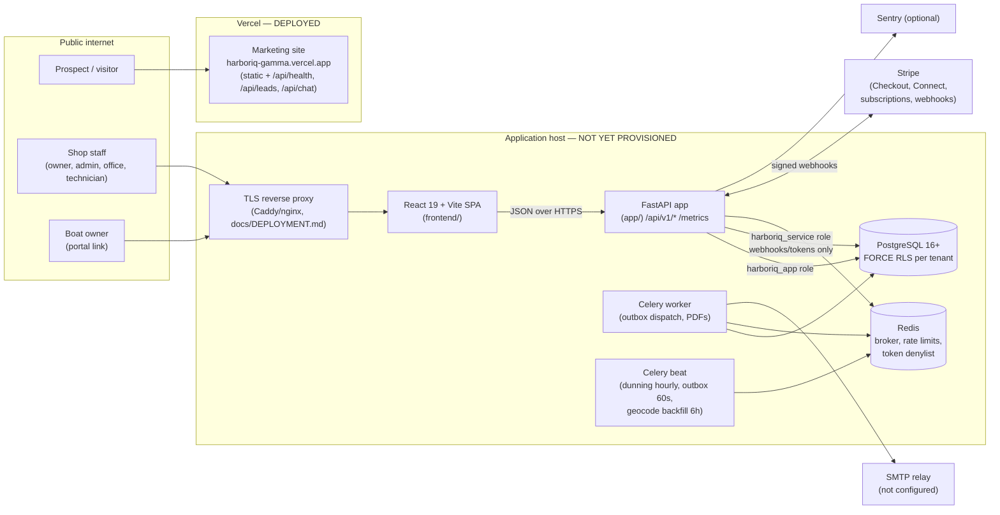
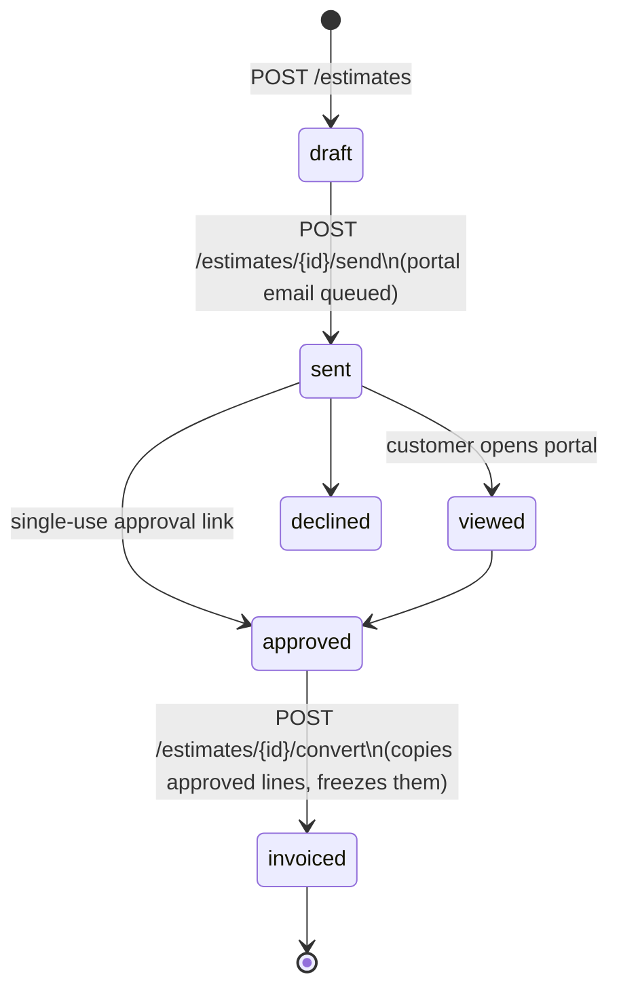

# HarborIQ Architecture

Status: v0.2.0 (2026-09-22). Describes what is in this repository and what is
deployed today. Decisions are recorded in [`docs/adr/`](adr/).

## System context

## Components

| Component | Tech | Location | Deployed? |
|---|---|---|---|
| Marketing site | Static site + Vercel serverless functions | Perplexity Project files `website/harboriq-marketing-site/` (not in this repo) | **Yes** — Vercel team `harbor-iq`, project `harboriq` |
| Web app | React 19, Vite 8, TanStack Query, Tailwind 4, React Router (browser or hash router) | `frontend/` | No |
| Mobile shell | Capacitor 8 wrapping the web app | `frontend/` (see `docs/mobile-launch-runbook.md`) | No (store signing pending) |
| API | FastAPI, SQLAlchemy 2, Pydantic 2, Python 3.12 | `app/` | No |
| Background jobs | Celery worker + beat on Redis | `app/core/celery_app.py`, `app/tasks/` | No |
| Database | PostgreSQL with Alembic migrations `0001`–`0025` (raw SQL in `alembic/sql/`) | `alembic/` | No (local/CI only) |
| Payments | Stripe SDK; Connect for shop payouts; subscriptions for HarborIQ plans | `app/services/stripe_*.py` | Test mode only |

## Request path and tenancy

1. The SPA calls `/api/v1/*` with a bearer access token (or cookie + CSRF).
2. `app/api/deps.py` authenticates the user and resolves `company_id` from
   the token.
3. `app/db/tenant.py` opens a transaction as `harboriq_app` and runs
   `SET LOCAL app.current_company_id = <company_id>`.
4. Every tenant table has a FORCE RLS policy comparing `company_id` to that
   setting, so a missing `WHERE company_id = …` in application code still
   cannot read or write another tenant's rows.
5. Pre-tenant paths (Stripe webhooks, portal and one-time public tokens,
   marketing lead capture) use `harboriq_service` and then set the tenant
   explicitly once it is resolved.

## Side effects: transactional outbox

Emails and other external side effects are written to `outbox_events` in the
same transaction as the business change (`app/services/outbox.py`) and
delivered by the Celery beat/worker loop (`app/services/outbox_dispatch.py`)
with retries and a `dead_letter` state after 5 attempts. This keeps "invoice
sent" and "email queued" atomic. Without SMTP credentials the dispatcher logs
emails instead of sending them.

## Money workflow

Invoices then follow `draft → sent → partially_paid/paid`, with void and
refund paths (`app/services/state_machines.py`, `app/services/invoices.py`).
Totals are always recomputed server-side from stored line items using
`Decimal` with half-up rounding to cents.

## Observability (actual)

- Structured JSON logs with request IDs (`app/core/logging.py`,
  `app/api/middleware.py`).
- Health: `GET /api/v1/healthz` (liveness), `GET /api/v1/readyz` (DB +
  Redis readiness).
- Metrics: Prometheus-format `GET /metrics`, protected by
  `METRICS_TOKEN` outside development.
- Errors: Sentry, enabled only when `SENTRY_DSN` is set.
- Not implemented: OpenTelemetry tracing, Grafana dashboards, Loki log
  shipping. These are deferred until there is a running production host to
  observe (see [`KNOWN_LIMITATIONS.md`](KNOWN_LIMITATIONS.md)).

## Reference

- API: [`API_REFERENCE.md`](API_REFERENCE.md), [`api/openapi.json`](api/openapi.json)
- Schema: [`DATABASE_SCHEMA.md`](DATABASE_SCHEMA.md)
- Security: [`SECURITY_OVERVIEW.md`](SECURITY_OVERVIEW.md)
- Deploy/rollback: [`DEPLOYMENT.md`](DEPLOYMENT.md), [`OPERATIONS_RUNBOOK.md`](OPERATIONS_RUNBOOK.md)
