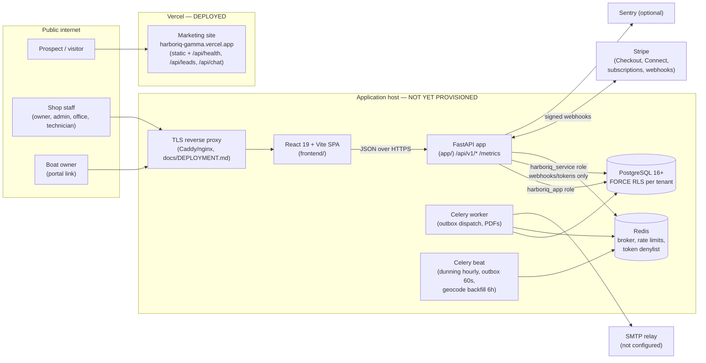
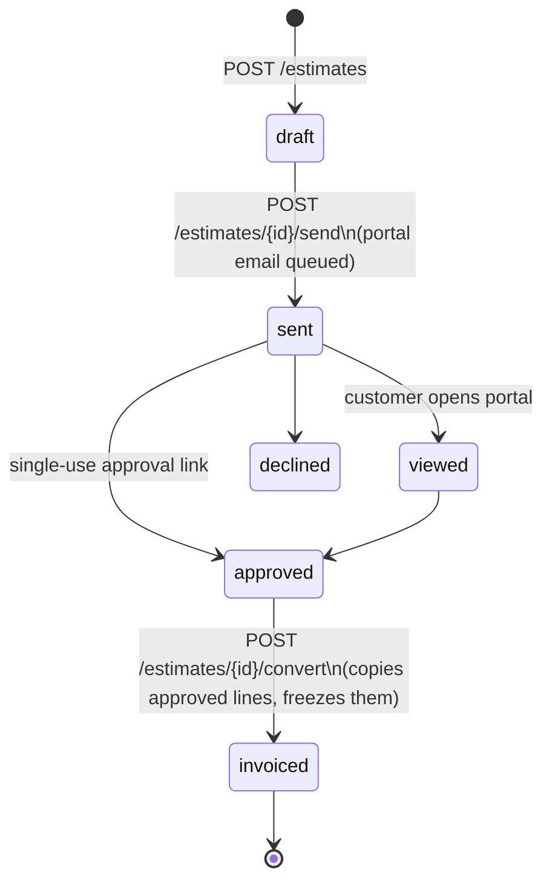
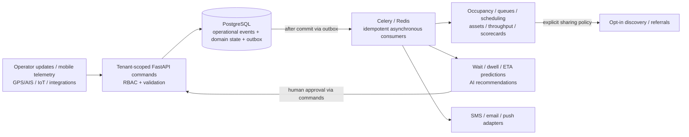

# HarborIQ Architecture

Status: v0.2.0 (2026-09-22). Current-state sections describe what is in this
repository and its deployment status. The Facility Operations Intelligence
section is **target architecture, not implemented or production-verified**.
Decisions are recorded in [`docs/adr/`](adr/).

## System context

```mermaid
flowchart LR
  subgraph Public["Public internet"]
    Visitor["Prospect / visitor"]
    Staff["Shop staff\n(owner, admin, office, technician)"]
    Customer["Boat owner\n(portal link)"]
  end

  subgraph Vercel["Vercel — DEPLOYED"]
    Site["Marketing site\nharboriq-gamma.vercel.app\n(static + /api/health, /api/leads, /api/chat)"]
  end

  subgraph AppHost["Application host — NOT YET PROVISIONED"]
    Proxy["TLS reverse proxy\n(Caddy/nginx, docs/DEPLOYMENT.md)"]
    SPA["React 19 + Vite SPA\n(frontend/)"]
    API["FastAPI app\n(app/)  /api/v1/*  /metrics"]
    Worker["Celery worker\n(outbox dispatch, PDFs)"]
    Beat["Celery beat\n(dunning hourly, outbox 60s,\ngeocode backfill 6h)"]
    PG[("PostgreSQL 16+\nFORCE RLS per tenant")]
    Redis[("Redis\nbroker, rate limits,\ntoken denylist")]
  end

  Stripe["Stripe\n(Checkout, Connect,\nsubscriptions, webhooks)"]
  SMTP["SMTP relay\n(not configured)"]
  Sentry["Sentry (optional)"]

  Visitor --> Site
  Staff --> Proxy --> SPA
  Customer --> Proxy
  SPA -->|JSON over HTTPS| API
  API -->|harboriq_app role| PG
  API -->|harboriq_service role\nwebhooks/tokens only| PG
  API --> Redis
  Worker --> PG
  Worker --> Redis
  Beat --> Redis
  Worker --> SMTP
  API <-->|signed webhooks| Stripe
  API --> Sentry
```

## Components

| Component | Tech | Location | Deployed? |
|---|---|---|---|
| Marketing site | Static site + Vercel serverless functions | Perplexity Project files `website/harboriq-marketing-site/` (not in this repo) | **Yes** — Vercel team `harbor-iq`, project `harboriq` |
| Web app | React 19, Vite 8, TanStack Query, Tailwind 4, React Router (browser or hash router) | `frontend/` | No |
| Mobile shell | Capacitor 8 wrapping the web app | `frontend/` (see `docs/mobile-launch-runbook.md`) | No (store signing pending) |
| API | FastAPI, SQLAlchemy 2, Pydantic 2, Python 3.12 | `app/` | No |
| Background jobs | Celery worker + beat on Redis | `app/core/celery_app.py`, `app/tasks/` | No |
| Database | PostgreSQL with Alembic migrations `0001`–`0025` (raw SQL in `alembic/sql/`) | `alembic/` | No (local/CI only) |
| Payments | Stripe SDK; Connect for shop payouts; subscriptions for HarborIQ plans | `app/services/stripe_*.py` | Test mode only |

## Request path and tenancy

1. The SPA calls `/api/v1/*` with a bearer access token (or cookie + CSRF).
2. `app/api/deps.py` authenticates the user and resolves `company_id` from
   the token.
3. `app/db/tenant.py` opens a transaction as `harboriq_app` and runs
   `SET LOCAL app.current_company_id = <company_id>`.
4. Every tenant table has a FORCE RLS policy comparing `company_id` to that
   setting, so a missing `WHERE company_id = …` in application code still
   cannot read or write another tenant's rows.
5. Pre-tenant paths (Stripe webhooks, portal and one-time public tokens,
   marketing lead capture) use `harboriq_service` and then set the tenant
   explicitly once it is resolved.

## Side effects: transactional outbox

Emails and other external side effects are written to `outbox_events` in the
same transaction as the business change (`app/services/outbox.py`) and
delivered by the Celery beat/worker loop (`app/services/outbox_dispatch.py`)
with retries and a `dead_letter` state after 5 attempts. This keeps "invoice
sent" and "email queued" atomic. Without SMTP credentials the dispatcher logs
emails instead of sending them.

## Money workflow

```mermaid
stateDiagram-v2
  [*] --> draft: POST /estimates
  draft --> sent: POST /estimates/{id}/send\n(portal email queued)
  sent --> viewed: customer opens portal
  sent --> approved: single-use approval link
  viewed --> approved
  sent --> declined
  approved --> invoiced: POST /estimates/{id}/convert\n(copies approved lines, freezes them)
  invoiced --> [*]
```

Invoices then follow `draft → sent → partially_paid/paid`, with void and
refund paths (`app/services/state_machines.py`, `app/services/invoices.py`).
Totals are always recomputed server-side from stored line items using
`Decimal` with half-up rounding to cents.

## Observability (actual)

- Structured JSON logs with request IDs (`app/core/logging.py`,
  `app/api/middleware.py`).
- Health: `GET /api/v1/healthz` (liveness), `GET /api/v1/readyz` (DB +
  Redis readiness).
- Metrics: Prometheus-format `GET /metrics`, protected by
  `METRICS_TOKEN` outside development.
- Errors: Sentry, enabled only when `SENTRY_DSN` is set.
- Not implemented: OpenTelemetry tracing, Grafana dashboards, Loki log
  shipping. These are deferred until there is a running production host to
  observe (see [`KNOWN_LIMITATIONS.md`](KNOWN_LIMITATIONS.md)).

## Target architecture: Facility Operations Intelligence

**Status: planned; not a claim of operational availability.** This layer sits
alongside the existing service-management platform, reusing its tenant identity,
CRM, vessels, jobs, slip reservations, dispatch, messaging, and billing rather
than replacing them. Existing reservations, maps, SMS, and rule-based dispatch
are foundations, not proof that the eight capabilities below are implemented.
The delivery epic and release gates live in the
[competitive parity roadmap](COMPETITIVE_PARITY_ROADMAP.md#facility-operations-intelligence--engineering-epic-planned).

### Capability boundaries

| Capability | Target responsibility |
|---|---|
| **Live Operations** | Real-time dock/slip occupancy, arrivals, departures, queue position/status, and assignments. Each observation exposes its source, observation time, receipt time, and freshness; a booking is not physical occupancy. |
| **Scheduling** | Appointments coordinated across dock capacity, technicians, equipment, and maintenance windows; conflict detection, rescheduling, cancellations, and no-shows. Extend existing job/slip scheduling without maintaining contradictory booking calendars. |
| **Automated Notifications** | Driver/operator arrival instructions, dock assignments, delays, schedule changes, service completion, and pickup notices through SMS/email/push, with channel consent, delivery state, retries, and deduplication. Console fallback is not delivery. |
| **Predictive Operations** | Wait-time and dwell-time forecasts using current queue, usable capacity, staffing, historical service durations, and arrival patterns. Include prediction horizon, confidence interval, input freshness, and an insufficient-data fallback. |
| **Performance Intelligence** | Explainable carrier/operator scorecards for on-time performance, dwell time, cancellations, no-shows, completion reliability, and exceptions. Expose component metrics, weights, sample counts, time window, exclusions, and score version. |
| **Asset Intelligence** | Vessels, trailers, service vehicles, lifts, forklifts, tools, and other equipment with location/source, assignment, availability/status, maintenance, inspection, and utilization histories. Operational tracking is independent of draft-only asset tokenization. |
| **HarborIQ AI Operations Engine** | Evidence-backed dock allocation, scheduling, staffing, queue optimization, preventive maintenance, and capacity recommendations. Show provenance, confidence, expected impact, constraints, and alternatives; consequential actions require authorized human approval. |
| **HarborIQ Network** | Opt-in discovery of capacity/services and referrals among participating marinas, boatyards, service companies, docks, technicians, carriers/operators, and customers. Explicitly shared listings—not unrestricted tenant data—support cross-facility matching and network effects. |

### Shared operational event foundation

```mermaid
flowchart LR
  Sources["Operator updates / mobile telemetry\nGPS/AIS / IoT / integrations"]
  API["Tenant-scoped FastAPI commands\nRBAC + validation"]
  Store[("PostgreSQL\noperational events + domain state + outbox")]
  Worker["Celery / Redis\nidempotent asynchronous consumers"]
  Views["Occupancy / queues / scheduling\nassets / throughput / scorecards"]
  Intelligence["Wait / dwell / ETA predictions\nAI recommendations"]
  Notify["SMS / email / push adapters"]
  Network["Opt-in discovery / referrals"]

  Sources --> API --> Store
  Store -->|after commit via outbox| Worker
  Worker --> Views
  Worker --> Intelligence
  Worker --> Notify
  Views -->|explicit sharing policy| Network
  Intelligence -->|human approval via commands| API
```

The canonical visit lifecycle is:

**appointment → arrival → queue → dock assignment → service → completion → departure**

An appointment is a plan; actual arrival, service, and departure are distinct
observations. Walk-ins can enter at arrival. Cancellations and no-shows terminate
planned visits without fabricating an arrival; reassignment, temporary departure,
and corrections require explicit events and validated transitions. Keep
appointment, visit, job, vessel/asset, and carrier/operator identities linked,
not collapsed into one overloaded status field.

- Each versioned event carries `event_id`, `event_type`, `schema_version`,
  `company_id`, `facility_id`, aggregate ID/version, lifecycle entity references,
  `occurred_at`, `received_at`, source/source reference, actor or integration ID,
  idempotency key, correlation/causation IDs, and a validated payload. Use UTC
  timestamps and a facility time zone for local scheduling.
- Persist domain changes, immutable operational history, and outbox delivery
  intent in one PostgreSQL transaction. The operational event log is durable
  history; the existing side-effect outbox is not a substitute for that log.
  Add explicit operational consumers rather than relying on unknown outbox event
  types being marked dispatched.
- Assume at-least-once transport, not exactly-once delivery. Consumers restore
  tenant context, deduplicate event IDs, handle aggregate ordering, retry safely,
  and expose dead letters and replay checkpoints. Late telemetry must not
  overwrite a newer observation; corrections retain the original evidence.
- Occupancy, queue/ETA/wait predictions, dwell, asset utilization, facility
  throughput, and carrier/operator metrics derive from this shared history.
  Replay must reproduce projections without resending notifications or executing
  approvals. Operational views remain usable when prediction/AI workers fail.

### Real-time contract and data quality

The first supported source is **authenticated operator updates**. Mobile
telemetry, GPS/AIS, IoT, and third-party integrations remain optional planned
adapters until individually implemented, secured, and verified. Record which
source is authoritative per facility/resource, including precedence when sources
disagree. Missing, stale, or conflicting data is **unknown**, never implicitly
vacant or zero wait; expected/reserved occupancy is labeled separately.

Proposed pilot acceptance targets (not current service guarantees): commit-to-
screen latency at p95 ≤5 seconds for connected push delivery or ≤30 seconds
for a documented polling fallback under the agreed pilot load. Every live screen
shows source, observed/received timestamps, data age, connection state, and a
stale/unknown indicator. A documented source-specific observation expiry is
required before enablement; the pilot default is 60 seconds without a new
observation or explicit operator reconfirmation. Refreshing the screen does not
refresh the observation. Operator-driven freshness measures the latest report,
not continuous physical surveillance. Verify end-to-end latency, disconnect/
reconnect behavior, and expiry before advertising “real-time.”

### Security, intelligence, and network boundaries

- Companies remain security tenants; facilities belong to a company. Tenant-safe
  composite foreign keys, PostgreSQL FORCE RLS, and server-side facility/RBAC
  checks cover new tables, API reads/writes, subscriptions, exports, and workers.
  Do not trust a client-supplied company/facility ID as authorization.
- Predictions record model/baseline version, feature/input timestamps, training
  window, forecast interval, and outcome linkage. Monitor wait/dwell error,
  interval calibration, drift, missing inputs, and performance by facility.
  Start with a transparent baseline; suppress stale/unsupported forecasts and
  fall back safely rather than inventing confidence.
- Recommendations record evidence event IDs, rule/model/prompt version where
  applicable, generation time, confidence, expected impact and assumptions,
  approving actor, decision, execution result, and override reason. Revalidate
  capacity, permissions, and constraints on approval. AI has no independent
  permission to send messages, change assignments, or execute other consequential
  actions; no raw tenant operational data goes to an external AI provider without
  an approved data-processing boundary.
- Network discovery uses explicit tenant opt-in and field-level publication
  grants, expiring capacity offers, scoped referrals, and revocation. Global
  discovery reads only a separate publication projection, not tenant-private
  events, customer details, locations, or scorecards. Recheck grants when reading
  cached listings and accepting referrals; withdraw revoked/expired listings.
  Cross-facility recommendations use only authorized shared data.
- Default-off, server-enforced capability flags and per-tenant rollout gates
  separate incomplete code from enabled products. Marketing/release statements
  require deployment evidence and verified acceptance tests, not architecture
  diagrams, mocked telemetry, console messages, or enabled flags alone.

## Reference

- API: [`API_REFERENCE.md`](API_REFERENCE.md), [`api/openapi.json`](api/openapi.json)
- Schema: [`DATABASE_SCHEMA.md`](DATABASE_SCHEMA.md)
- Security: [`SECURITY_OVERVIEW.md`](SECURITY_OVERVIEW.md)
- Deploy/rollback: [`DEPLOYMENT.md`](DEPLOYMENT.md), [`OPERATIONS_RUNBOOK.md`](OPERATIONS_RUNBOOK.md)
