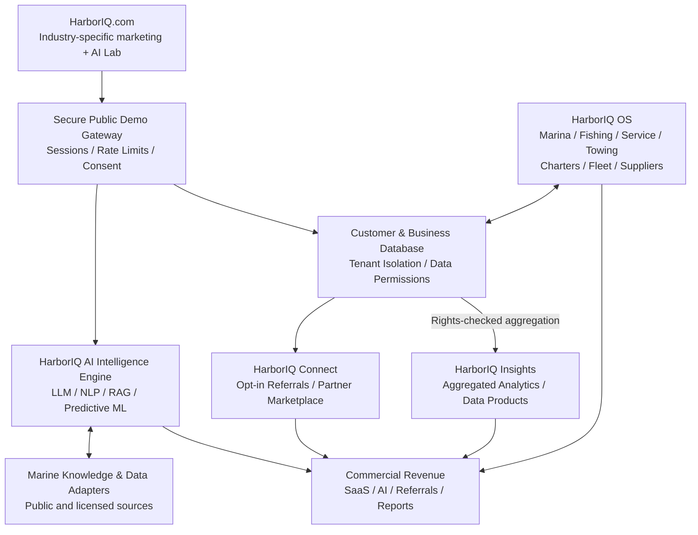

# Marine Industry Platform Architecture

## Direction

HarborIQ's product direction is **one shared intelligence and data foundation
with specialized experiences for marine-industry sectors**. The diagram below
captures the intended architecture; it is not a claim that every component is
already implemented.

Public demonstrations must not expose tenant records or imply real emergency
dispatch. Referrals require purpose-specific customer authorization, recipient
disclosure, and access control. Analytics require validated data rights,
provenance, retention controls, and effective de-identification; sensitive
locations and identifiable commercial records are not public data products.
Use only authorized source integrations, and do not claim support for a
manufacturer or regulatory workflow until verified.

## Verified repository baseline (2026-10-10)

- The checked-in application is a marine-service operating system with
  customer/vessel, work-order, invoice, inventory, marina slip, and reservation
  workflows. Product status and deferred features are tracked in
  [`PRODUCT_OVERVIEW.md`](PRODUCT_OVERVIEW.md).
- Dispatch suggestions are deterministic rule-based scores, not an AI/ML
  feature. The marine diagnostics and recall-intelligence requirements are
  documented as not built.
- Public lead capture is implemented at `POST /api/v1/public/leads`, with
  rate limiting, a honeypot, duplicate suppression, and service-role storage.
  Lead administration requires a configured token.
- The marketing-site review reports that the website source is outside this
  repository. This repository change does not modify or deploy that website.
- This repository does not currently provide the public AI demo gateway,
  shared LLM/RAG engine, external marine knowledge adapters, referral
  marketplace, or aggregated industry analytics described above. Those are
  proposed architecture, not launch-day capabilities.

## Implemented increment

Public marketing leads now accept an optional, validated industry classification
for the 12 industry selector categories. Existing callers remain compatible:
omitted industry values are stored as `NULL`. The category is visible to
authorized lead administrators and in internal lead notifications. It does
not by itself authorize marketing contact, data sharing, referrals, or analytics
use; no consent or permission is inferred from classification.

## Next increments

1. Bring the marketing website source under version control and apply its
   multi-industry discovery experience with working, verified calls to action.
2. Define an authenticated, rate-limited public demo gateway and consent model
   before exposing any AI experience.
3. Implement shared AI provider management and sector contexts only after
   security, data access, evaluation, observability, and operating safeguards
   are defined.
4. Expand the operating system by validated sector demand while preserving
   tenant isolation.
5. Build permissioned referrals and rights-checked analytics only after
   recipient authorization, contractual data rights, and quality controls are
   in place.
